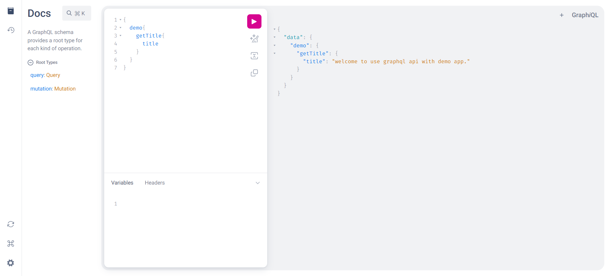
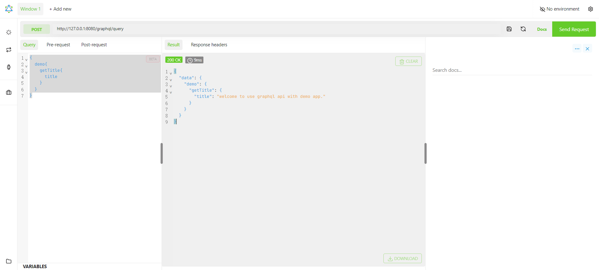

# graphql-api
基于graph-gophers开源项目搭建的graphql api服务器，可用于graphql api开发

### 开发流程
+ 在internal/graphql/sdl目录以及module/xxx项目目录任意目录下定义.graphql数据schema
+ 参考demo在module/demo/graphql/demo_query和module/demo/graphql/demo_mutation下面写好业务逻辑
+ 在internal/graphql/schema/目录下，复制执行go-bindata -ignore=\.go  -ignore=\.proto -ignore=\.keep -ignore=\.DS_Store -pkg=schema -o=bindata.go ../../../module/... ../sdl/...
+ 生成更新bindata后,启动项目即可，如有报错，则根据报错排除逻辑和语法

### 效果

